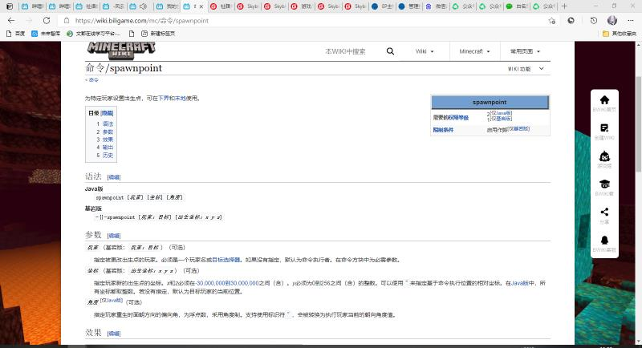
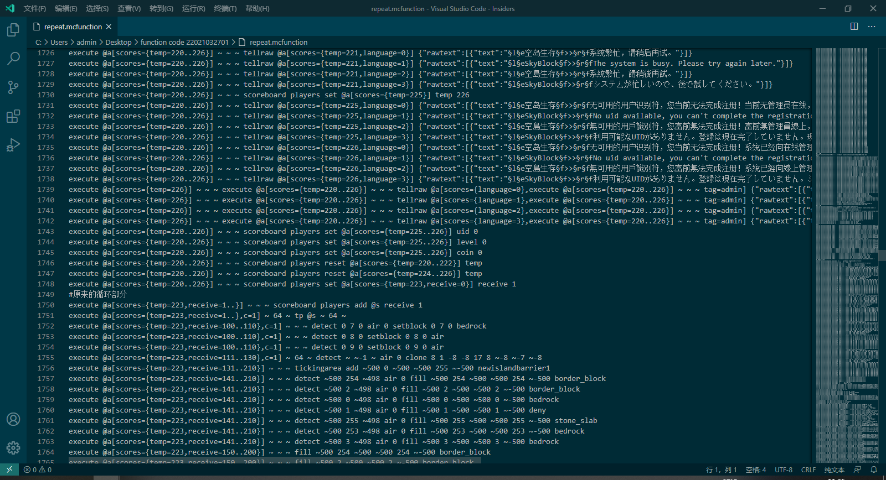
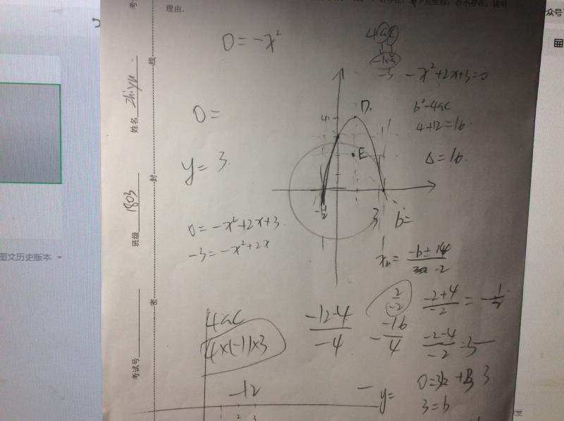
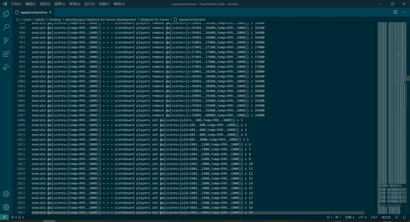
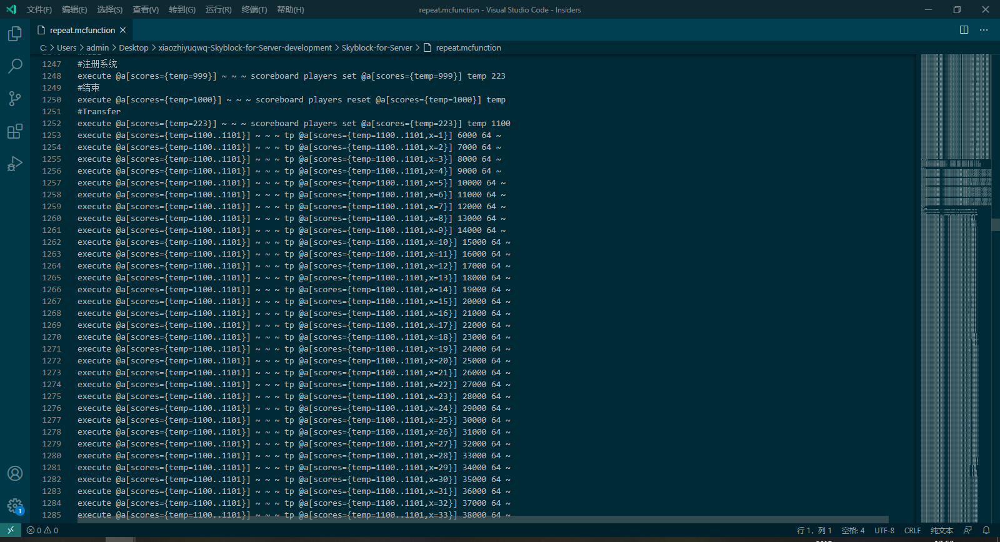

# 【命令向】用原版命令构建空岛生存（跪求加精）

P.S.原来华为论坛上的，搞过来了。

[【命令向】用原版命令构建空岛生存（跪求加精） (huawei.com)](https://appgallery.cloud.huawei.com/ag/fp/t1915299223176265756?ps=1&sid=2129082719966093327&locale=zh_CN&connect_redirect=1&shareTo=qq&shareFrom=appmarket#/)

*本文由祉语原创。

嘿，大家好！这里祉语。今天呢，我们来整一点简单的教程，比如我游戏上经常被私信的问题：“空岛是如何传送的？”

首先，为什么我们要使用“传送”返回岛屿而不是“死亡回岛”呢？

1.死亡回岛会占用玩家的重生点，如果玩家选择了其他的重生点会原地覆盖之前的数据。

2.MCBE之中有一条删除指定玩家的重生点数据，如果有手残的管理那么数据找都找不回来

另外呢，死亡回岛也会清空玩家的饱食度，目前在空岛服务器之中，大部分玩家在饱食度为0的时候会选择自杀来恢复饱食度，这种操作基本上就是报废了空岛服务器的食品用途。

好的，那么我们来看看如何在MCBE中使用原版命令完成传送。

*这只是我的解决方案。

1.在玩家加入游戏的时候分配uid，uid会记录玩家的岛屿数据，这样玩家的重生点就可以不被占用。

2.玩家有了uid，我们下一步要对uid进行处理，由于uid的数字位数是不确定的，可以有一位数，也可能有五位数，所以我们处理这个数据的时候要保证每一种uid版本都可以被系统识别。那么如何处理uid并且锁定岛屿呢？我的解决方案是：新建两个记分板，定位x轴与y轴（对应MCx轴与z轴），以世界（0，0）为原点建立平面直角坐标系。以MC1000格方块为单位长度，以（5，5）（5，-5）（-5，5）（-5，5）为系统保留区域进行岛屿分配。

3.把uid解析完成之后，我们得出了两个记分板的两个数值，假设uid为1解析的数值是（1，1），我们把这个坐标带入之前建议的坐标系中。由于系统把5000格为保留区域，故解析数值（1，1）在该坐标系中其实是（1+5，1+5），即（6，6）。

4.我们的系统只会识别解析数值（1，1），再使用tp命令对玩家进行传送。MC中的exe套tp可以以玩家为命令执行者进行执行，故（1，1）的数值对应执行execute @p[scores={x=1}] ~ ~ ~ tp @s 6000 64 ~与execute @p[scores={z=1}] ~ ~ ~ tp @s ~ 64 6000。最后我们就完成了简易的空岛系统。

至此，空岛的岛屿传送就完成了。基于这样的岛屿分配方案，只要增加两条命令即可允许岛屿上限沿2的指数级增长。这只是我本人的处理方案，当然肯定会有更好的解决方案，还请各路大佬轻喷。另外对于该项目，可以前往GitHub与Gitee上搜索用户xiaozhiyuqwq（小祉语qwq）查看。BB：跪求加精

